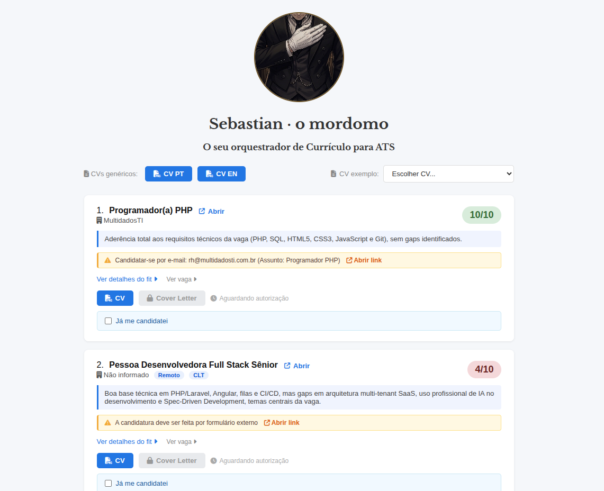
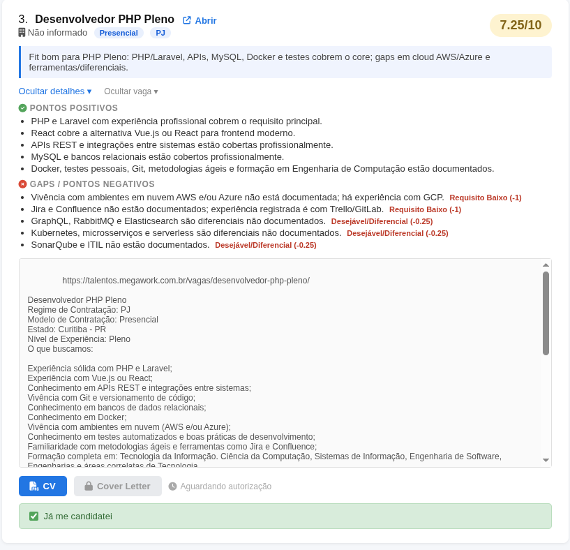
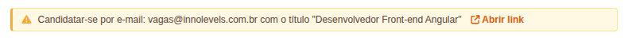

<div align="center">
   
</div>

# Sebastian · o mordomo - O seu orquestrador de Currículo para ATS

<div align="center">

[](LICENSE)

[](https://agents.md)

</div>

O agente de IA capaz de processar vagas em lote, fazer o fit com a vaga, gerar currículo (Curriculum Vitae - CV) e carta de apresentação (Cover Letter - CL) por vaga seguindo critérios de ATS, com dashboard local, seja para uma vaga no Brasil ou na gringa.
O dashboard exibe informações importantes sobre cada vaga, incluindo: modalidade de trabalho (Remoto, Presencial ou Híbrida), tipo de contratação (CLT, PJ ou CLT/PJ), score de fit, pontos positivos e gaps. Ele também sinaliza automaticamente alguns alertas por vaga — ver [Alertas e avisos por vaga](#alertas-e-avisos-por-vaga).

<div align="center">
   
</div>

O Sebastian combina o uso de agente de IA + um dashboard que exibe o resultado de tudo o que foi gerado pelo agente.

# Sumário
- [Por que usar o Sebastian?](#por-que-usar-o-sebastian)
- [Sobre os ATS e AI match - Você acha que sabe o que é, mas provavelmente não sabe](#sobre-os-ats-e-ai-match---você-acha-que-sabe-o-que-é-mas-provavelmente-não-sabe)
- [Glossário](#glossário)
- [Mapa de arquivos](#mapa-de-arquivos)
- [Privacidade — seus dados ficam com você](#privacidade--seus-dados-ficam-com-você)
- [Requisitos](#requisitos)
- [Agentes e modelos testados](#agentes-e-modelos-testados)
- [Como usar?](#como-usar-)
    - [Resumo do fluxo](#resumo-do-fluxo)
    - [Instalação e execução](#1-instalação-e-execução)
    - [Informações que você precisa fornecer](#2-informações-que-você-precisa-fornecer)
        - [Dados pessoais](#dados-pessoais)
        - [ai/skills/cv-base/SKILL.md](#aiskillscv-baseskillmd)
        - [ai/skills/contexto/SKILL.md](#aiskillscontextoskillmd)
        - [Vagas](#vagas)
    - [Dashboard](#3-dashboard)
        - [Alertas e avisos por vaga](#alertas-e-avisos-por-vaga)
    - [Fluxo com o agente para gerar CV/CL](#4-fluxo-com-o-agente-para-gerar-cvcl)
    - [CV genérico](#5-cv-genérico)
    - [Entrevista](#6-entrevista)
    - [Pós uso](#7-pós-uso)
    - [Solução rápida de problemas](#8-solução-rápida-de-problemas)
- [Regras de geração de fits, CV e CL](#regras-de-geração-de-fits-cv-e-cl)
    - [Testes Automatizados](#testes-automatizados)
        - [Hacking Reward](#hacking-reward)
- [Disclaimers](#disclaimers)
- [Me compre um café](#me-compre-um-café)

# Por que usar o Sebastian?

Você tem tido a sensação de que as respostas das vagas parecem automatizadas ou como se viessem de uma IA? Pois é, provavelmente são mesmo.

Algumas empresas ou plataformas de vagas onde você costuma se candidatar usam ATSs (*Applicant Tracking Systems*) que automatiza processos do recrutamento e ajuda a filtrar os currículos (seja com ou sem IA) e é aqui onde a maioria dos candidatos é "eliminado" da vaga.

O Sebastian ajuda a gerar CVs e CLs legíveis para esses sistemas, aumentando suas chances de ser chamado para uma entrevista, identificando essas palavras-chave e incluíndo no seu CV/CL, tornando-o mais personalizado.

# Sobre os ATS e AI match - Você acha que sabe o que é, mas provavelmente não sabe.

Diferente do que muitos candidatos acreditam, o ATS não é uma ferramenta de IA para filtrar currículos, ele muito mais que isso! Às vezes até sem IA envolvida. O ATS é uma solução completa que as empresas contratam para gerenciar o processo de recrutamento e seleção do início ao fim. Ele ajuda a organizar o processo de recrutamento, desde a publicação da vaga até a contratação do candidato, incluindo triagem de currículos, agendamento de entrevistas, comunicação com os candidatos, escolher quais plataformas a vaga será divulgada, agendamento de abertura de vagas. Hoje, as plataformas de vagas onde você costuma se candidatar, elas não são só anunciantes de vagas, mas sim uma solução de ATS que as empresas contratam.

Esses ATS permitem usar filtros, por exemplo, palavras-chave. Alguns deles inclusive ranqueia os candidatos e os currículos que não atendem aos critérios do ATS terá uma nota baixa. Os filtros e os ranques podem fazer o seu CV ficar "invisível" para o recrutador, te eliminando indiretamente, mesmo que você seja um candidato qualificado.

Os principais motivos do uso dessas soluções são: plataforma unificada para gerenciar todas as vagas, análise de dados das candidaturas (tempo de contratação, taxa de conversão, NPS do processo), processos automatizados de comunicação e abertura de vagas e **o que mais impacta os candidatos**, filtrar o grande volume de candidatos que se candidatam para uma vaga. Não é incomum no Linkedin, por exemplo, você encontrar vagas com **centenas** de candidatos. O ATS ajuda a filtrar esses currículos e escolhê-los para uma próxima etapa de avaliação "manual", com, por exemplo, 20 candidatos apenas.

Alguns ATS podem ter ou não um AI match embutido, que ajuda a filtrar os currículos. Quando não tem, o ATS apenas filtra os currículos com base em critérios objetivos, como palavras-chave, experiência e formação, de forma bem manual, de tal forma que se no seu currículo estiver "Back-end" e o recrutador filtrar por "Backend", pode ser que você fique fora da busca. Quando tem, ele vai além e tenta entender o contexto do currículo e da vaga para determinar se o candidato é adequado para a vaga, mas ainda assim, seu currículo tem que estar mais adaptado para a vaga.

Exemplo de plataformas de vagas conhecidas que usam ATS com filtros e/ou AI match:

| Plataforma                           | Evidência de Filtros ou AI match                                                                                                                                            | Link oficial                                                                                |
|--------------------------------------|-----------------------------------------------------------------------------------------------------------------------------------------------------------------------------|---------------------------------------------------------------------------------------------|
| **Workday**                          | "AI-powered candidate matching that identifies exact and similar skills"                                                                                                    | [workday.com](https://www.workday.com/en-us/topics/hr/applicant-tracking-system.html)       |
| **Greenhouse**                       | "AI-powered filters organize applications based on how they match your defined job criteria, such as skills and experience."                                                | [greenhouse.com](https://www.greenhouse.com/real-talent-candidate-matching)                 |
| **Indeed** (Smart Sourcing)          | "Go beyond keyword matching with natural language prompts that deliver right-fit talent based on skills, activity, and profile signals."                                    | [indeed.com](https://www.indeed.com/employers/solutions/smart-sourcing)                     |
| **LinkedIn** (Recruiter)             | "Search understands context, matching based on the specific qualifications you’re looking for..."                                                                           | [business.linkedin.com](https://business.linkedin.com/hire/ai-assisted-search-and-projects) |
| **Catho**                            | "Deixe nossa inteligência artificial trabalhar por você. O Catho Express busca rapidamente os candidatos com maior compatibilidade e com interesse comprovado na sua vaga." | [catho.com.br](https://www.catho.com.br/empresas/)                                          |
| **GeekHunter**                       | "recursos automatizados aplicados pela GeekHunter para apoiar entrevistas, enriquecer perfis, gerar recomendações, realizar matching ..."                                   | [geekhunter.com.br](https://www.geekhunter.com.br/pt/termos-de-uso)                         |

**Observação:** O fato de uma empresa não estar listada aqui não significa que ela usa ou não usa ATS e/ou filtros ou AI match.

# Glossário

| Termo       | Significado                                                                                                                            |
|-------------|----------------------------------------------------------------------------------------------------------------------------------------|
| **ATS**     | *Applicant Tracking System* — software que as empresas usam para filtrar currículos automaticamente. O CV precisa ser legível por ele. |
| **CV**      | *Curriculum Vitae* — o currículo.                                                                                                      |
| **CL**      | *Cover Letter* — carta de apresentação.                                                                                                |
| **Fit**     | Quão alinhado o seu perfil está com a vaga.                                                                                            |
| **Score**   | Nota do fit, de 0 a 10.                                                                                                                |
| **Gap**     | Requisito da vaga que o seu perfil não cobre (reduz o score).                                                                          |
| **CV base** | Seu "grande currículo" com todas as experiências — a fonte de verdade da qual o Sebastian extrai cada CV personalizado.                |

# Mapa de arquivos
Você pode ver o mapa de arquivos do sistema no [AGENTS.md](AGENTS.md#mapa-de-arquivos-do-sistema).

# Privacidade — seus dados ficam com você

Tudo roda **localmente** na sua máquina. O Sebastian não envia seus dados para nenhum servidor próprio (o processamento acontece na ferramenta de agente de IA que você escolher usar).

Os arquivos com informações pessoais **não são versionados** — já estão no [`.gitignore`](.gitignore) e nunca vão para o repositório:

- `src/json/candidate-data.js` — seus dados de contato
- `ai/skills/cv-base/SKILL.md` — seu CV base (fonte de verdade)
- `ai/skills/contexto/SKILL.md` — suas instruções pessoais
- `src/json/jobs-data.js` e `src/json/generic-cv-data.js` — CVs/CLs gerados
- `vagas.txt` — as vagas que você cola
- `insights.md` — preparação de entrevista

O repositório versiona apenas os equivalentes `*.example` (modelos sem dados reais). Ao clonar, o Sebastian cria as cópias locais a partir desses modelos no primeiro uso.

# Requisitos

- Node.js 22.21+
- npm
- Uma ferramenta de agente de IA compatível com a convenção `AGENTS.md` (ela vai ler as instruções do Sebastian neste repositório)

# Agentes e modelos testados

O Sebastian segue a convenção `AGENTS.md`, então deve funcionar com qualquer ferramenta de agente de IA compatível. Até agora, foi testado com:

**Agentes**
- GitHub Copilot
- Claude Code
- Open Code

**Modelos**
- Sonnet 4.5 / 4.6 / 5
- MiMo v2.5

**Comandos / Pré prompts**
- GitHub Copilot
- Claude Code
- Open Code
- Cursor
- Codex

# Como usar?

## Resumo do fluxo
- Inicie a conversa com o Sebastian com um "olá Sebastian" (ou use o comando `/iniciar`) e responda os dados pessoais que ele solicitar que serão colocados no CV e CL
- Cole as vagas no arquivo `vagas.txt` que você pretende se candidatar.
- Use o comando `/fit` ou diga "processar as vagas". O Sebastian vai analisar cada vaga e gerar um fit (score + gaps) com o seu perfil antes de gerar qualquer CV ou CL.
- Acesse o dashboard `http://localhost:3001/index.html` e veja os fits para decidir quais vagas você ainda tem interesse de se candidatar. O fit vai te ajudar a decidir se vale a pena se candidatar ou não a partir dos gaps que você tem com a vaga e o score do seu fit
- Use o comando `/gerar` ou diga "gerar os CV e/ou CL das vagas" para autorizar o Sebastian
- Volte ao dashboard e você verá os botões de CV e CL liberados para acesso. Reveja cada um deles e peça ajustes caso necessário.

> Os comandos (`/fit`, `/gerar`, etc.) são a forma recomendada de acionar o Sebastian. Se a sua ferramenta de agente de IA não suportar slash commands, use sempre a frase alternativa em linguagem natural indicada ao lado de cada comando neste README.

## 1) Instalação e execução

- Sebastian precisa de Node.js para gerar os CVs. Baixe aqui: https://nodejs.org/en/download/archive/v22.21.1
- Instale os pacotes necessários rodando o comando:
```bash
npm install
```

- Iniciar o projeto com o comando:
```bash
npm start
```

## 2) Informações que você precisa fornecer

### Dados pessoais
Abra este diretório na sua ferramenta de agente de IA e inicie a conversa. Use o comando `/iniciar` ou diga **"Olá Sebastian, vamos começar"**. Na primeira vez, ele vai te perguntar alguns dados pessoais importantes para colocar no currículo (nome, contato, localização, portfólio). O campo `portfolio` aceita tanto um site pessoal quanto um link de repositórios (GitHub, GitLab, etc). Você pode pedir ao agente para atualizar esses dados a qualquer momento.

### [ai/skills/cv-base/SKILL.md](ai/skills/cv-base/SKILL.md)
Base de experiência do candidato (fonte de verdade).
Aqui você vai criar uma espécie de grande currículo com todas as suas experiências, habilidades, educação e idiomas. O Sebastian vai usar esse CV base para extrair as informações relevantes para cada vaga e gerar um CV personalizado.
Não economize detalhes aqui, pois quanto mais completo for o CV base, melhor serão os CVs personalizados gerados para cada vaga.
<br>
Dicas:
1. Use o [CV base template](ai/skills/cv-base/SKILL.md.example) como base. Lá há sugestões de seções e subseções, mas você pode adicionar ou remover a medida que achar necessário.
2. Fale detalhes de cada projeto/feature que você fez no seu trabalho, de preferência as mais longas e complexas, informando:
    - O que foi o projeto/feature (ex: Aplicação de Cache usando Redis)
    - Em quanto tempo levou para ser feito
    - Quais foram as tecnologias utilizadas
    - Quais foram os resultados obtidos (Ex: aumentou em 20% o número de vendas ou reduziu em 30% o tempo de resposta do sistema)
    - Que posição você exercia nesse projeto/feature
    - Como era o dia a dia do projeto/feature (ex: reuniões diárias, planejamento semanal, Kanban, Scrum)
3. Fale não apenas das suas experiências profissionais, mas também de projetos pessoais e acadêmicos, trabalhos voluntários, monitorias, TCCs, programa de iniciação científica
4. Fale um pouco sobre você: suas soft skills, o que você prefere fazer e trabalhar, se gosta mais de presencial/hibrído/remoto, se tem disponibilidade para viajar ou se mudar
5. Você pode citar também conceitos que você conhece, mas nunca praticou ou tem pouca prática. Ex: sitemap, SSR, TDD, SOLID.
6. Site integrações que você fez como: gateway de pagamento, serviços de nuvem, distribuidores, sistemas do governo.
7. Projetos pessoais (opcional): se tiver, informe nome, período, stack e uma descrição. O Sebastian vai gerar uma seção "Projetos Pessoais" no CV quando houver projetos relevantes para a vaga.
8. Certificações (opcional): se tiver, informe nome, instituição emissora, link e ano. O Sebastian vai gerar uma seção "Certificações" no CV quando houver certificados relevantes para a vaga.
9. Site (opcional): se uma experiência, formação, projeto, certificação ou idioma tiver um site (empresa, universidade, repositório, certificado), adicione uma linha `- Site: URL` logo abaixo do heading daquele item. O Sebastian transforma isso automaticamente num link clicável no nome dessa entrada no CV gerado. Veja o formato exato no [CV base template](ai/skills/cv-base/SKILL.md.example).

### [ai/skills/contexto/SKILL.md](ai/skills/contexto/SKILL.md)
Aqui são você pode dar contexto para o Sebastian e definir regras do que preencher em algumas situações e como dele deve agir. Sinta-se livre para colocar aqui o que quiser!
<br>
Exemplos:
1. Apesar de eu ter trabalhado profissionalmente apenas com Backend, eu tenho bastante conhecimento e prática com Frontend, especialmente em React, então pode preencher experiência com React mesmo que não tenha sido profissional.
2. Apesar de eu ter trabalhado com Java, foi um período muito curto e não me sinto seguro trabalhando com essa stack por conta própria, portanto qualquer vaga que exigir experiência sólida, coloque como um gap.
3. Não informar o exato número de vendas que a empresa teve, isso é um dado sigiloso e só lhe informei para te dar um contexto de que o sistema era grande
4. Quero apenas vagas remotas. Se forem híbridas ou presenciais, informar isso como gap e colocar score 0

Obs: Com o tempo, a medida que for usando o Sebastian e pedindo correções, ele pode lhe sugerir informações novas a serem preenchidas no contexto. A medida que você aceitar as sugestões, Sebastian vai adicioná-los automaticamente.

### [Vagas](vagas.txt)
Copie o texto bruto das vagas que deseja se candidatar separadas por `-----------------------------`. Pode ser tanto em português quanto em inglês. O Sebastian vai identificar o idioma automaticamente.

**Importante:** Antes de cada vaga, cole o link direto da vaga. O Sebastian vai usar esse link no dashboard para facilitar o acesso à vaga original.

Formato:
```
https://www.linkedin.com/jobs/view/123456789

[Texto da vaga aqui...]
-----------------------------

https://www.linkedin.com/jobs/view/987654321

[Próxima vaga...]
```

<br>
Você pode usar o arquivo [vagas.txt.example](vagas.txt.example) como base.


## 3) Dashboard

Acesse o dashboard em `http://localhost:3001/index.html` após iniciar o projeto com `npm start`.

<div align="center">
   
</div>

O dashboard centraliza todas as informações geradas pelo Sebastian por vaga:

- **Score de fit** — nota de 0 a 10 indicando o quão alinhado o seu perfil está com a vaga
- **Pontos positivos e gaps** — o que joga a seu favor e o que falta para a vaga
- **Modalidade e tipo de contratação** — Remoto, Presencial ou Híbrido; CLT, PJ ou CLT/PJ
- **Botões de CV e CL** — ficam bloqueados até o Sebastian ser autorizado a gerar os documentos; após a geração, abrem a página correspondente
- **Link direto para a vaga** — acesso à vaga original para conferir antes de se candidatar

Use o dashboard para comparar as vagas, decidir quais têm fit suficiente para prosseguir e acessar os documentos gerados. Além dos dados de fit, o dashboard também exibe [alertas automáticos](#alertas-e-avisos-por-vaga) por vaga.

<div align="center">
   
</div>

### Alertas e avisos por vaga
Além do score de fit e dos gaps, o dashboard sinaliza automaticamente alguns pontos de atenção em cada vaga, para você não perder requisitos importantes na hora de se candidatar:

- **Candidatura externa:** quando a vaga exige aplicação por e-mail ou por formulário/link externo (em vez do fluxo padrão da plataforma), o dashboard exibe um aviso com o atalho direto — link `mailto:` para e-mail ou `https://` para o formulário.
- **Localização divergente:** quando a vaga é **Presencial** ou **Híbrida** em uma cidade diferente da sua, o dashboard destaca a modalidade e a cidade da vaga, alertando que pode exigir deslocamento ou mudança.
- **Vagas da Gupy:** como a Gupy não permite anexar currículo (apenas carta de apresentação), o Sebastian sugere gerar uma CL para essas vagas.

> Esses avisos são apenas indicativos, gerados a partir do texto da vaga. Sempre confira a descrição original antes de se candidatar.

<div align="center">
   
</div>

## 4) Fluxo com o agente para gerar CV/CL

1. Use o comando `/fit` ou diga "processar as vagas". No meio do processo, o Sebastian pode te fazer perguntas de sobre os requisitos da vaga para ter certeza se você tem ou não uma habilidade específica, ou alguma outra dúvida. Responda às perguntas para que ele possa ter um melhor entendimento do seu perfil e gerar um fit mais preciso. Baseado nas respostas, o Sebastian pode sugerir alterações no seu CV ou no contexto.
2. Após os fits serem gerados, acesse-os no dashboard `http://localhost:3001/index.html`. Olhe a descrição da vaga e os gaps para ver se estão coerentes. Caso não estejam, você pode pedir correções
    - Você pode e deve pedir para remover as vagas em que o seu score está muito baixo.
3. Feito a revisão dos fits, use o comando `/gerar` ou diga "gerar os CVs e/ou CLs". Você também pode pedir para gerar somente um dos dois pelo número da vaga.
   Exemplo: 1) CV; 2) CL; 3) CV e CL.
4. Após gerar os documentos, Sebastian roda uma auditoria automática e apresenta um relatório informando quais CVs/CLs tiveram possíveis infrações de regras quantitativas (tamanho, quantidade de bullets, etc.) e quais passaram. Se houver infrações, ele vai te perguntar se deseja uma rodada de correção automática:
    - **Não:** encerra o fluxo — você pode revisar e pedir ajustes manualmente depois
    - **Sim:** Sebastian corrige os documentos com falha e apresenta um novo relatório. Esse ciclo se repete até você encerrar ou todos passarem
5. Reveja os CVs/CLs no dashboard `http://localhost:3001/index.html`. Veja o que foi gerado e se está coerente. Caso queira ajustes, peça para corrigir o CV/CL da vaga específica.
   O Sebastian também pode identificar alguns problemas e sugerir ajustes.
6. Para baixar o CV/CL, existe um botão no canto inferior direito da tela **Baixar PDF**

Após autorização, os botões de CV/CL da vaga são liberados no dashboard.

## 5) CV genérico

Em algumas plataformas de vagas, é necessário subir um CV genérico para depois aplicar para as vagas. O Sebastian pode te ajudar a gerar esse CV genérico baseado no seu CV base e contexto.
Basta pedir "gere um CV genérico" que ele vai gerar 2, um português e um inglês.

## 6) Entrevista

Sebastian também pode te ajudar a se preparar para a entrevista de uma vaga específica. Ele vai analisar os requisitos e gerar perguntas e respostas para você praticar.

Use o comando `/entrevista <número da vaga>` ou diga "entrevista para a vaga <número>".
<br> Exemplo: `/entrevista 2` ou diga `Entrevista para a vaga 2`

Ou você pode colar a vaga no chat com o agente e pedir para gerar a entrevista.
<br> Exemplo: `Entrevista para a vaga abaixo: [texto da vaga]`

O resultado da entrevista é gerado no arquivo `insights.md` para você revisar.

## 7) Pós uso

- Se quiser processar um novo lote de vagas do zero, basta limpar as vagas antigas `vagas.txt` e preencher com as novas, depois usar o comando `/reiniciar` ou dizer "reiniciar processo" que o Sebastian vai reiniciar o processo.
    - Se você quiser processar apenas adicionar novas vagas, basta adicionar novas vagas no arquivo `vagas.txt` e usar o comando `/fit` ou pedir para processar as demais vagas.
- É interessante guardar os CVs e CLs numa pasta para quando for chamado para uma entrevista, você saiba qual CV/CL a empresa recebeu.

## 8) Solução rápida de problemas

- **Botão PDF falha:** confirme se `npm start` está rodando na porta `3001`.
- **CV/CL bloqueado:** a vaga ainda não foi autorizada.

# Regras de geração de fits, CV e CL
- Todas as regras de geração de fits, CV e CL estão documentadas nos agentes e skills em: `ai/agents/` e `ai/skills/`.

## Testes Automatizados
- Existem alguns testes automatizados que tentam validar se algumas das regras descritas nos agentes e skills estão sendo seguidas. O Sebastian roda ele uma vez e ao identificar alguma falha em passar em algum teste, ele dirá qual documento e regra foi infringida e te perguntará se deseja fazer uma rodada de correção automática. Você pode recusar se achar desnecessário

### Hacking Reward
O fato da etapa de correção ser "manualmente" solicitada pelo usuário é proposital. Permitir a IA testar e corrigir automaticamente sem a supervisão, em loop e em várias rodadas costuma incentivar a IA a "trapacear" para passar nos testes, inserindo ruídos como frases sem sentido ou sem conexão com a vaga, ou com o candidato. Esse fenômeno é chamado de Hacking Reward. Por isso, o usuário precisa autorizar cada rodada de correção.

# Desenvolvimento
- Para desenvolvimento e testes, o diretório `fixtures/fake-candidates/` contém CVs de candidatos fictícios prontos para uso. Consulte o [`fixtures/fake-candidates/README.md`](fixtures/fake-candidates/README.md) para entender a estrutura e como criar novos fixtures.
- O agente está orientado a alterar apenas alguns arquivos específicos listados em [AGENTS.md](AGENTS.md#caso-2--erros-identificados--novas-instruções) para preservar as instruções do Sebastian e layout das páginas para os usuários. Caso queira alterar o comportamento do agente, você pode criar um `desenvolvedor.md` vazio no root do projeto, como está indicado na sessão citada anteriormente

# Disclaimers
- O Sebastian **NÃO GARANTE** que os fits, CVs e CLs gerados vão passar no filtro do ATS ou que você vai ser chamado para uma entrevista, muito menos que o que foi gerado está coerente com o que foi gerado. É **SUA** responsabilidade revisar o que foi gerado e pedir ajustes caso necessário. O Sebastian é apenas uma ferramenta para te ajudar a gerar CVs e CLs legíveis para ATS, mas não substitui a revisão humana.
- O objetivo do Sebastian **NÃO** é gerar documentos falsos ou mentirosos, inventando experiências ou habilidades que o candidato não tem, mas que seriam importantes para a vaga. A fase de avaliação de fit foi feita justamente para identificar vagas que podem não fazer sentido para você, evitando perda de tempo para candidato e recrutador.
- Se o seu score da vaga for vermelho (abaixo de 5), reconsidere se vale a pena se candidatar para essa vaga e revise o fit para ter certeza de que realmente aquela vaga possa não ser para você.
- O Sebastian **NÃO** buscas de vagas automaticamente para você (pelo menos ainda não 👀), muito menos faz scrapping de sites para isso. É você quem procura as vagas e cola no `vagas.txt`, o Sebastian apenas processa as vagas para gerar os fits, CVs e CLs.
- O Sebastian **NÃO** aplica para as vagas automaticamente para você. É você quem aplica para as vagas após checar o que foi gerado pelo Sebastian.

# Me compre um café
Se você curtiu o projeto do Sebastian, especialmente se ele te ajudou a conseguir uma nova vaga, considere apoiar esse projeto aberto com o valor de um cafezinho a partir do PIX.
O projeto é e sempre será open source e gratuito. O seu apoio ajuda a manter o projeto vivo e a desenvolver novas features.

PIX QR-code
<div align="center">
   
</div>

PIX copia e cola:
```
00020126800014br.gov.bcb.pix01368a2736bc-1b9e-4655-ba11-1017ea798f610218Sebastian agradece5204000053039865802BR5918Gabriel O. Santana6002NA62070503***630442B8
``` 

---

<div align="center">
   
   <h2 style="padding-top: 0;margin-top:0">Sebastian · o mordomo</h2>
</div>